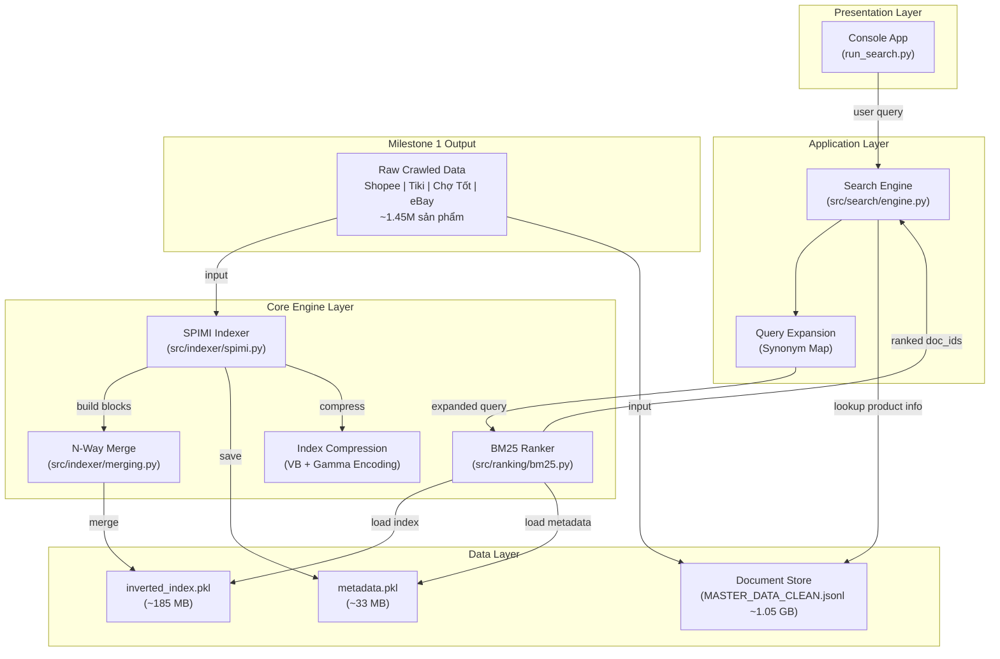

# BÁO CÁO MILESTONE 2: CORE SEARCH ENGINE

## Môn: SEG301 – E-Commerce Search Engine Project

| Thành viên | MSSV | Vai trò | Đóng góp Milestone 2 |
|---|---|---|---|
| **Trịnh Khải Nguyên** | QE190129 | Crawler Lead | SPIMI Indexer, Merging, Unit Tests |
| **Lê Hoàng Hữu** | QE190142 | Crawler Dev | Index Compression, BM25 Tuning |
| **Ngô Tuấn Hoàng** | QE190076 | Crawler Dev | Search Engine, Console App, Query Expansion |

---

## 1. Tổng Quan Milestone 2

### 1.1. Mục tiêu

Milestone 2 tập trung xây dựng **Core Search Engine** hoàn chỉnh trên nền dữ liệu đã xử lý từ Milestone 1 (~1.45 triệu sản phẩm, file `MASTER_DATA_CLEAN.jsonl`), bao gồm:

- Xây dựng Inverted Index bằng thuật toán **SPIMI** (Single-Pass In-Memory Indexing)
- Triển khai thuật toán xếp hạng **BM25** (Best Matching 25)
- Tích hợp thành Search Engine có Query Expansion
- Console App cho phép người dùng tìm kiếm sản phẩm
- Viết Unit Tests kiểm thử các thành phần

---

## 2. Kiến Trúc Hệ Thống

### 2.1. Sơ đồ kiến trúc tổng quan



### 2.2. Workflow xây dựng Index (Offline - chạy 1 lần)

**Sơ đồ luồng xử lý:**

```mermaid
flowchart TD
    Drive[(MASTER_DATA_CLEAN.jsonl<br/>~1.45M products)] -->|Streaming| Reader(Streaming Reader<br/>O(1) RAM)
    Reader --> Tokenizer(Tokenizer<br/>lowercase + split)
    Reader -.-> Meta(Tính doc_lengths<br/>+ avg_doc_length)
    Meta -.-> MetaFile[(metadata.pkl)]
    
    Tokenizer --> Check{Block đầy?<br/>> 500MB}
    
    Check -- Chưa --> RAM[Thêm vào Block RAM<br/>term → postings list]
    RAM -.-> Tokenizer
    
    Check -- Rồi --> Flush[Flush: Sort + Write<br/>block_N.pkl]
    Flush -.-> Tokenizer
    
    Flush --> Merge((N-Way Merge))
    Merge --> Out[(inverted_index.pkl)]
    
    style Drive fill:#f9f,stroke:#333,stroke-width:2px
    style Out fill:#bbf,stroke:#333,stroke-width:2px
    style MetaFile fill:#bbf,stroke:#333,stroke-width:2px
```

**Các bước thực hiện chính:**

1. **Đọc dữ liệu (Streaming):** Đọc tuần tự từng dòng từ file `MASTER_DATA_CLEAN.jsonl` giúp tối ưu RAM ($O(1)$) thay vì load toàn bộ file. Tiến hành đếm và trích xuất chiều dài tài liệu để bảo lưu vào `metadata.pkl`.
2. **Tiền xử lý (Tokenizer):** Chuẩn hóa chữ thường (lowercase) và tách token (split) đối với các trường văn bản.
3. **Xây dựng Block (In-Memory Indexing):** Đưa các token vào block tạm trên RAM. Nếu dung lượng block đầy (vượt ngưỡng 500MB), quá trình **Flush** sẽ được kích hoạt: sắp xếp theo bảng chữ cái và đẩy ra file `block_N.pkl`. Nếu chưa đầy, tiếp tục đọc dòng mới.
4. **Gộp Block (N-Way Merge):** Ghép tuần tự các file block theo thứ tự để hợp nhất thành một `inverted_index.pkl` hoàn chỉnh.

### 2.3. Workflow tìm kiếm (Online - mỗi query)

**Sơ đồ luồng xử lý:**

```mermaid
flowchart TD
    Input([User Input<br/>'ip 17 prm']) --> Exp[Query Expansion<br/>'iphone 17 pro max']
    Exp --> Seg[PyVi Segmentation<br/>'iphone 17 pro max']
    Seg --> Tok[Tokenize<br/>['iphone', '17', 'pro', 'max']]
    Tok --> BM[BM25 Scoring<br/>IDF × TF normalization]
    BM --> Boost[Title Relevance Boost<br/>Coverage-based scoring]
    Boost --> Lookup[(Doc Store Lookup<br/>Enrich title, price, link)]
    Lookup --> Div[Platform Diversification<br/>Round-Robin các sàn]
    Div --> Output([Display Results<br/>Console / UI])
    
    style Input fill:#d4edda,stroke:#28a745,stroke-width:2px
    style Output fill:#d4edda,stroke:#28a745,stroke-width:2px
    style Lookup fill:#f8d7da,stroke:#dc3545,stroke-width:2px
```

**Các bước thực hiện chính:**

1. **Chuẩn hóa truy vấn (Preprocessing):**
   - **Query Expansion:** Chuyển đổi các từ viết tắt phổ biến thành dạng đầy đủ (VD: `ip` $\rightarrow$ `iphone`, `prm` $\rightarrow$ `pro max`).
   - **PyVi Segmentation & Tokenize:** Tách từ tiếng Việt đồng bộ với dữ liệu đã được index, chia nhỏ câu truy vấn thành các token rời rạc.
2. **Xếp hạng kết quả (Ranking):**
   - **BM25 Scoring:** Chấm điểm độ liên quan của từng sản phẩm thông qua thuật toán BM25 (tính toán tần suất từ khóa hiển thị).
   - **Title Relevance Boost:** Cộng dồn điểm số (nhân hệ số) đối với các kết quả có độ bao phủ tiêu đề sát nhất với ý định người dùng (tránh các trường hợp spam keyword / phụ kiện).
3. **Tổng hợp và Hiển thị (Display):**
   - **Doc Store Lookup:** Truy xuất thông tin (tiêu đề, giá bán, link) trực tiếp, cực nhanh từ bộ nhớ dựa theo File Id ($O(1)$).
   - **Platform Diversification:** Lấy đan xen kết quả từ các sàn thương mại điện tử (Shopee, Tiki...) theo quy tắc vòng lặp (Round-Robin), đảm bảo kết quả đa dạng và minh bạch về giá trị.

---

## 3. Chi Tiết Các Thành Phần

### 3.1. SPIMI Indexer (`src/indexer/`)

**Mục đích:** Xây dựng Inverted Index từ tập dữ liệu lớn (~1.05 GB) mà không bị tràn RAM, sử dụng kỹ thuật chia block và merge.

#### 3.1.1. Thuật toán SPIMI (`src/indexer/spimi.py`)

**Single-Pass In-Memory Indexing** hoạt động như sau:

1. **Đọc streaming:** Đọc từng dòng JSONL — O(1) RAM per document, không load toàn bộ file
2. **Tokenize:** Lowercase + split theo khoảng trắng, loại token 1 ký tự (nhiễu). Ưu tiên sử dụng trường `title_segmented` (đã tách từ bởi PyVi ở Milestone 1), fallback sang `title_clean` và `title`
3. **Build block:** Mỗi document được thêm vào block RAM hiện tại dưới dạng `term → [(doc_id, tf)]`
4. **Flush block:** Khi bộ nhớ ước tính vượt ngưỡng (500MB), block được **sort theo alphabet** và ghi ra file `.pkl`
5. **Lưu metadata:** `doc_count`, `doc_lengths`, `avg_doc_length` — contract giữa Indexer và Ranker

**Code — Tokenizer & add_document:**

```python
# src/indexer/spimi.py

def tokenize(self, text):
    """Tách text thành danh sách tokens."""
    if not text:
        return []                           # Guard clause: tránh crash khi text rỗng
    tokens = text.lower().split()           # Lowercase + tách theo khoảng trắng
    return [t for t in tokens if len(t) > 1]  # Loại token 1 ký tự (nhiễu)

def add_document(self, doc_id, tokens):
    """Thêm 1 document vào block hiện tại trên RAM."""
    # Bước 1: Đếm TF (Term Frequency) cho document này
    tf_map = defaultdict(int)
    for token in tokens:
        tf_map[token] += 1              # Đếm: "iphone" xuất hiện 3 lần → tf = 3

    # Bước 2: Ghi posting vào inverted index trên RAM
    for term, tf in tf_map.items():
        self.current_block[term].append((doc_id, tf))  # term → [(doc_id, tf)]

    # Bước 3: Lưu chiều dài document (cho BM25 tính length normalization)
    self.doc_lengths[doc_id] = len(tokens)

    # Bước 4: Ước tính RAM tăng thêm (~50 bytes/posting)
    self.current_memory += len(tf_map) * 50
```

**Code — Vòng lặp index chính (Streaming + Flush):**

```python
# src/indexer/spimi.py — hàm build_index()

with open(documents_path, 'r', encoding='utf-8') as f:
    for line in f:                                        # Từng dòng một = O(1) RAM
        doc = json.loads(line.strip())
        doc_id = doc.get('id', '')

        # Ưu tiên title_segmented (đã tách từ bởi PyVi ở M1)
        text = doc.get('title_segmented') or doc.get('title_clean') or doc.get('title', '')
        tokens = self.tokenize(text)

        self.add_document(doc_id, tokens)
        doc_count += 1

        if self.is_block_full():                          # RAM đầy?
            block_path = self.write_block_to_disk(blocks_dir)  # → Flush ra disk!
            block_files.append(block_path)
```

**Code — Flush block xuống disk:**

```python
def write_block_to_disk(self, output_dir):
    """Flush block hiện tại xuống ổ cứng, giải phóng RAM."""
    # Sort theo alphabet trước khi ghi (yêu cầu của SPIMI để merge sau)
    sorted_block = {}
    for key in sorted(self.current_block.keys()):
        sorted_block[key] = self.current_block[key]

    block_path = os.path.join(output_dir, f"block_{self.block_count}.pkl")
    with open(block_path, 'wb') as f:
        pickle.dump(sorted_block, f)      # Serialize ra file nhị phân

    # Reset trạng thái RAM
    self.current_block = defaultdict(list)   # Giải phóng RAM
    self.current_memory = 0
    self.block_count += 1
    return block_path
```

**Độ phức tạp:**

- Thời gian: O(n) với n = tổng số tokens toàn corpus — mỗi token chỉ xử lý 1 lần (single-pass)
- Không gian: O(block_size) RAM — không phụ thuộc kích thước corpus tổng thể
- Ước tính bộ nhớ: ~50 bytes/posting (gồm tuple `(doc_id, tf)` + overhead dictionary)

#### 3.1.2. N-Way Merge (`src/indexer/merging.py`)

Ghép tuần tự các block index đã sort thành 1 Inverted Index hoàn chỉnh.

```python
# src/indexer/merging.py

def merge_two_blocks(block1, block2):
    """Ghép 2 block dictionary lại thành 1."""
    merged = {}
    all_terms = set(block1.keys()) | set(block2.keys())   # Union tất cả terms

    for term in all_terms:
        # Nối danh sách postings của cùng 1 term từ 2 block
        list1 = block1.get(term, [])
        list2 = block2.get(term, [])
        merged[term] = list1 + list2

    # Sắp xếp lại theo alphabet
    return {key: merged[key] for key in sorted(merged.keys())}


def n_way_merge(block_files, output_path):
    """Ghép tất cả file block thành 1 index cuối cùng (sequential merge)."""
    with open(block_files[0], 'rb') as f:
        merged = pickle.load(f)          # Load block đầu làm base

    for i in range(1, len(block_files)):
        with open(block_files[i], 'rb') as f:
            block = pickle.load(f)
        merged = merge_two_blocks(merged, block)   # Merge lần lượt từng cặp

    with open(output_path, 'wb') as f:
        pickle.dump(merged, f)
```

**Kết quả:** file `inverted_index.pkl` (~185 MB), cấu trúc: `{term: [(doc_id, tf), ...]}`

> **Lưu ý:** Hiện tại dùng sequential pairwise merge. Với số block nhỏ (< 5 block) thì hiệu quả đủ tốt. Có thể chuyển sang min-heap k-way merge nếu cần tối ưu trong tương lai.

#### 3.1.3. Index Compression (`src/indexer/compression.py`)

Triển khai 2 phương pháp nén chỉ mục theo lý thuyết Information Retrieval:

| Phương pháp | Mô tả | Ứng dụng |
|---|---|---|
| **Variable Byte Encoding** | Mỗi byte dùng 7 bit data + 1 bit cao nhất làm cờ kết thúc. Số nhỏ dùng ít byte hơn | Nén doc_id gaps và tf trong postings list |
| **Elias Gamma Encoding** | Gồm phần unary (biểu diễn độ dài) + phần binary offset. Hiệu quả cho số nhỏ | Nén các khoảng cách (gaps) giữa doc_id liền kề |

```python
# src/indexer/compression.py

def variable_byte_encode(number):
    """
    Mã hóa số nguyên bằng Variable Byte.
    Mỗi byte dùng 7 bit chứa data, 1 bit cao nhất làm cờ kết thúc.
    """
    if number == 0:
        return bytes([128])

    result = []
    while True:
        result.insert(0, number % 128)
        if number < 128:
            break
        number = number // 128

    result[-1] += 128    # Đánh dấu byte cuối cùng (bit cao = 1)
    return bytes(result)


def gamma_encode(number):
    """
    Mã hóa số nguyên bằng Elias Gamma.
    Gồm phần unary (biểu diễn độ dài) + phần offset (giá trị).
    """
    binary = bin(number)[2:]   # Chuyển sang nhị phân, bỏ prefix "0b"
    length = len(binary)

    unary = '1' * (length - 1) + '0'   # Phần unary: (length-1) bit 1 + 1 bit 0
    offset = binary[1:]                  # Phần offset: binary bỏ bit đầu

    return unary + offset
```

**Ví dụ:** Số 5 (binary: `101`, length=3)

- Unary: `110` (2 bit 1 + 1 bit 0)
- Offset: `01` (binary bỏ bit đầu)
- Gamma code: `11001`

**Hiện trạng:** Module compression đã triển khai đầy đủ. Index hiện dùng Python pickle (tiện cho development). Dự kiến tích hợp vào pipeline ở Milestone 3.

---

### 3.2. BM25 Ranker (`src/ranking/bm25.py`)

**Mục đích:** Xếp hạng documents theo mức độ phù hợp với truy vấn, dựa trên mô hình xác suất.

#### 3.2.1. Công thức BM25

```
score(D, Q) = Σ IDF(qi) × [ tf × (k1 + 1) ] / [ tf + k1 × (1 - b + b × |D| / avgdl) ]
```

Trong đó:

- **IDF(qi)** = log( (N - n + 0.5) / (n + 0.5) + 1 ) — Term xuất hiện trong ít document → IDF cao
- **tf**: Term Frequency — số lần term xuất hiện trong document D
- **k1** (= 1.2): Kiểm soát mức bão hòa của TF (diminishing returns)
- **b** (= 0.9): Kiểm soát mức phạt cho document dài (length normalization)
- **|D|**: Chiều dài document (số tokens), **avgdl**: Chiều dài trung bình

#### 3.2.2. Code triển khai

```python
# src/ranking/bm25.py

class BM25Ranker:
    def __init__(self, k1=1.2, b=0.9):
        self.k1 = k1     # Điều chỉnh qua tune.py
        self.b = b
        self.idf_cache = {}   # Cache tránh tính log lại nhiều lần

    def compute_idf(self, term):
        """Tính IDF với cache."""
        if term in self.idf_cache:
            return self.idf_cache[term]   # Cache hit: trả ngay

        postings = self.inverted_index.get(term, [])
        doc_freq = len(postings)   # n: số docs chứa term

        if doc_freq == 0:
            return 0.0

        # Công thức IDF chuẩn Robertson-Spärck Jones
        idf = math.log((self.doc_count - doc_freq + 0.5) / (doc_freq + 0.5) + 1.0)
        self.idf_cache[term] = idf   # Lưu cache
        return idf

    def rank(self, query, top_k=10):
        """Xếp hạng documents theo BM25."""
        scores = {}

        for term in query.lower().split():
            postings = self.inverted_index.get(term, [])
            idf = self.compute_idf(term)

            for doc_id, tf in postings:
                doc_len = self.doc_lengths.get(doc_id, self.avg_doc_length)

                # Áp dụng công thức BM25
                numerator = tf * (self.k1 + 1)
                denominator = tf + self.k1 * (1 - self.b + self.b * doc_len / self.avg_doc_length)
                term_score = idf * (numerator / denominator)

                # Tích lũy điểm cho document
                scores[doc_id] = scores.get(doc_id, 0) + term_score

        # Sắp xếp giảm dần theo score, lấy top K
        result = sorted(scores.items(), key=lambda x: x[1], reverse=True)
        return result[:top_k]
```

#### 3.2.3. Parameter Tuning

Sử dụng script `tune.py` thử nghiệm 4 bộ tham số trên 3 query mẫu:

| Bộ tham số | k1 | b | Mục đích | Nhận xét |
|---|---|---|---|---|
| Baseline | 1.5 | 0.75 | Chuẩn IR, cân bằng | Title dài bị spam vẫn xếp cao |
| **Đã chọn** | **1.2** | **0.9** | Phạt title dài mạnh hơn | Kết quả sạch nhất, ưu tiên title ngắn chính xác |
| Anti-stuffing | 0.8 | 0.95 | Giảm ảnh hưởng TF | Quá aggressive, title có từ lặp hợp lệ bị phạt |
| Strong | 0.5 | 1.0 | Chống keyword stuffing tối đa | Quá cực đoan, nhiều kết quả hợp lệ bị đẩy xuống |

**Lý do chọn k1=1.2, b=0.9:** Dữ liệu TMĐT có title thường ngắn (5-15 từ), nhưng một số seller thêm keyword spam (VD: "iPhone 15 giá rẻ sale sốc hot deal free ship..."). `b=0.9` phạt mạnh các title dài bất thường, `k1=1.2` giúp TF bão hòa nhanh hơn, giảm ảnh hưởng của keyword repetition.

---

### 3.3. Search Engine (`src/search/engine.py`)

**Mục đích:** Module tích hợp trung tâm, kết nối SPIMI Index + BM25 + Document Store thành API tìm kiếm hoàn chỉnh.

#### 3.3.1. Query Expansion (Mở rộng truy vấn)

Hệ thống chuyển **từ viết tắt phổ biến** sang từ đầy đủ qua bảng mapping tĩnh:

```python
# src/search/engine.py

SYNONYM_MAP = {
    "ip": "iphone",
    "iph": "iphone",
    "prm": "pro max",
    "promax": "pro max",
    "ss": "samsung",
    "sam": "samsung",
    "dt": "điện thoại",
    "mtb": "máy tính bảng",
    "tn": "tai nghe",
    "sac": "sạc",
}

def expand_query(self, query):
    """
    Mở rộng truy vấn: chuyển từ viết tắt sang từ đầy đủ.
    "ip 14prm" → "iphone 14 pro max"
    """
    # Bước 1: Tách các token dính nhau (VD: "14prm" → "14" + "prm")
    raw_tokens = query.lower().split()
    tokens = []
    for t in raw_tokens:
        sub_tokens = re.findall(r'[a-zA-Zàáảãạ...]+|\d+', t)  # Tách chữ/số
        tokens.extend(sub_tokens if sub_tokens else [t])

    # Bước 2: Thay thế từ viết tắt
    expanded = [SYNONYM_MAP.get(token, token) for token in tokens]
    return " ".join(expanded)
```

| Viết tắt | Mở rộng | Ví dụ |
|---|---|---|
| `ip`, `iph` | `iphone` | `"ip 17 prm"` → `"iphone 17 pro max"` |
| `prm`, `promax` | `pro max` | |
| `ss`, `sam` | `samsung` | `"ss galaxy"` → `"samsung galaxy"` |
| `dt` | `điện thoại` | |
| `mtb` | `máy tính bảng` | |
| `tn` | `tai nghe` | |
| `sac` | `sạc` | `"sac du phong"` → `"sạc du phong"` |

#### 3.3.2. Vietnamese Word Segmentation (Tách từ tiếng Việt)

```python
# src/search/engine.py

def segment_query(self, query):
    """
    Tách từ tiếng Việt — đồng bộ với cách dữ liệu đã được index.
    Quan trọng: data trong index đã qua PyVi (M1), nên query cũng phải qua PyVi
    để token khớp nhau.
    """
    segmented = ViTokenizer.tokenize(query)
    return segmented
```

| Query gốc | Sau PyVi | Giải thích |
|---|---|---|
| `"tai nghe bluetooth"` | `"tai_nghe bluetooth"` | Khớp token `tai_nghe` trong index |
| `"điện thoại iphone"` | `"điện_thoại iphone"` | Khớp token `điện_thoại` trong index |
| `"bao cao su"` | `"bao_cao_su"` | Nhận diện từ ghép tiếng Việt |

#### 3.3.3. Title Relevance Boost (Tinh chỉnh điểm theo độ phù hợp title)

**Vấn đề:** BM25 thuần túy không phân biệt được **sản phẩm chính** và **phụ kiện**. Ví dụ khi tìm `"iPhone 14 Pro Max"`:

- Sản phẩm chính: `"iPhone 14 Pro Max 256GB"` (title ngắn, tập trung)
- Phụ kiện: `"Ốp lưng silicon dành cho iPhone 14 - iPhone 14 Plus - iPhone 14 Pro - iPhone 14 Pro Max trong suốt"` (title dài)

Cả hai đều có BM25 score tương đương vì cùng chứa các từ khóa. Nhưng người dùng muốn thấy sản phẩm chính trước.

**Giải pháp — Coverage-based scoring:**

```python
# src/search/engine.py — trong hàm search()

# --- Title Relevance Boost ---
# coverage = số từ query / số từ title
# Title ngắn gần giống query → sản phẩm chính → boost
# Title dài liệt kê nhiều model → phụ kiện → phạt
query_words = expanded_query.lower().split()
title_words = title.lower().split()
coverage = len(query_words) / len(title_words) if title_words else 0

if coverage >= 0.6:
    boosted_score *= 1.8   # Sản phẩm chính (VD: "iPhone 14 Pro Max 128GB")
elif coverage >= 0.4:
    boosted_score *= 1.3   # Sản phẩm + mô tả thêm
elif coverage >= 0.3:
    boosted_score *= 0.7   # Có thể là phụ kiện
else:
    boosted_score *= 0.3   # Rõ ràng phụ kiện, title rất dài → phạt mạnh
```

| Coverage | Hệ số nhân | Ý nghĩa | Ví dụ |
|---|---|---|---|
| ≥ 60% | × 1.8 | Sản phẩm chính, title ngắn gần giống query | `"iPhone 14 Pro Max 128GB"` (5/6 = 83%) |
| ≥ 40% | × 1.3 | Sản phẩm + mô tả thêm | `"iPhone 14 Pro Max Chính Hãng VN/A 256GB"` (5/9 = 56%) |
| ≥ 30% | × 0.7 | Có thể là phụ kiện | title hơi dài |
| < 30% | × 0.3 | Rõ ràng phụ kiện, title rất dài | `"Kính cường lực iPhone 12-13-14-14 Plus-14 Pro-14 Pro Max"` (5/16 = 31%) |

#### 3.3.4. Platform Diversification (Đa dạng hóa kết quả theo sàn)

**Vấn đề:** Do phân bố dữ liệu không đều (Shopee chiếm 55%, Tiki 30%), BM25 thuần túy thường trả về top 10 toàn từ 1 sàn.

**Giải pháp 2 bước:**

```python
# src/search/engine.py

def diversify_results(self, results, top_k=10, max_per_platform=3):
    """
    Round-Robin: lần lượt lấy từ mỗi sàn theo thứ tự score.
    Đảm bảo kết quả đa dạng, không bị dominate bởi 1 sàn.
    """
    # Bước 1: Lọc kết quả quá thấp so với top 1
    # Nếu top 1 score = 40, chỉ giữ score >= 8 (20% của 40)
    top_score = results[0]["bm25_score"]
    results = [r for r in results if r["bm25_score"] >= top_score * 0.2]

    # Bước 2: Nhóm theo sàn
    by_platform = {}
    for r in results:
        by_platform.setdefault(r["platform"], []).append(r)

    # Sắp xếp sàn theo score cao nhất (sàn có top 1 cao nhất đi trước)
    platform_order = sorted(by_platform.keys(),
                            key=lambda p: by_platform[p][0]["bm25_score"],
                            reverse=True)

    # Round-Robin: lấy lần lượt 1 kết quả từ mỗi sàn
    diversified = []
    platform_count = {}
    while len(diversified) < top_k:
        added = False
        for platform in platform_order:
            count = platform_count.get(platform, 0)
            if count < len(by_platform[platform]) and count < max_per_platform:
                diversified.append(by_platform[platform][count])
                platform_count[platform] = count + 1
                added = True
        if not added:
            max_per_platform += 1   # Nới lỏng giới hạn nếu cần

    return diversified
```

**Ví dụ:** BM25 trả về 8 Shopee + 2 Tiki + 1 eBay → sau diversify:
`Shopee → Tiki → eBay → Shopee → Tiki → Shopee → Shopee → ...`

#### 3.3.5. Document Store

```python
# src/search/engine.py

def load(self):
    """Nạp index và document store vào RAM."""
    self.ranker.load_index(self.index_dir)   # Load BM25 index

    # Load document store: đọc JSONL gốc vào dictionary
    # Trade-off: ~2-3 GB RAM để đạt tốc độ lookup O(1)
    with open(self.data_path, 'r', encoding='utf-8') as f:
        for line in f:
            doc = json.loads(line.strip())
            doc_id = doc.get('id')
            if doc_id:
                self.doc_store[doc_id] = doc   # {doc_id: product_info}
```

**RAM footprint:** ~2-3 GB RAM. Đây là trade-off có chủ đích: hy sinh RAM để đạt tốc độ lookup O(1) thay vì phải seek lại file JSONL.

#### 3.3.6. Pipeline tìm kiếm hoàn chỉnh

```python
# src/search/engine.py

def search(self, query, top_k=10):
    # Bước 0: Mở rộng từ viết tắt
    # "ip 14prm"  →  "iphone 14 pro max"
    expanded_query = self.expand_query(query)

    # Bước 1: Tách từ tiếng Việt (đồng bộ với index)
    # "điện thoại"  →  "điện_thoại"
    segmented_query = self.segment_query(expanded_query)

    # Bước 2: BM25 Ranking (lấy top_k×5 để có đủ candidates cho diversify)
    # Nếu muốn 10 kết quả → BM25 trả 50 → các bước sau chọn 10 tốt nhất
    ranked_results = self.ranker.rank(segmented_query, top_k=top_k * 5)

    # Bước 3: Gắn thông tin sản phẩm + Title Relevance Boost
    results = []
    for doc_id, score in ranked_results:
        product = self.doc_store.get(doc_id, {})
        boosted_score = self._apply_title_boost(score, expanded_query, product.get("title",""))
        results.append({
            "id": doc_id,
            "title": product.get("title", "N/A"),
            "price": product.get("price", 0),
            "platform": product.get("platform", "Unknown"),
            "link": product.get("link", ""),
            "bm25_score": round(boosted_score, 4),
        })

    results.sort(key=lambda x: x["bm25_score"], reverse=True)

    # Bước 4: Platform Diversification (Round-Robin giữa các sàn)
    return self.diversify_results(results, top_k)
```

---

### 3.4. Console App (`run_search.py`)

Ứng dụng dòng lệnh tương tác cho phép người dùng tìm kiếm sản phẩm:

- Load Search Engine khi khởi động (index + document store)
- Vòng lặp nhận input từ người dùng, gõ `exit` để thoát
- Hiển thị Top 10 kết quả với: title, price (format VNĐ), platform, BM25 score, link
- Đo và hiển thị thời gian tìm kiếm (ms)

**Ví dụ output:**

```
Search (type 'exit' to quit): iphone 15

Found 10 results in 45.23 ms:

 1. [shopee] Điện Thoại iPhone 15 Pro Max 256GB - Chính Hãng VN/A
    Price: 25.990.000 d
    BM25 Score: 8.2341
    Link: https://shopee.vn/...

 2. [tiki] iPhone 15 128GB
    Price: 19.490.000 d
    BM25 Score: 7.8912
    Link: https://tiki.vn/...
```

---

## 4. Testing

### 4.1. Tổng quan

Dự án sử dụng **pytest** với 3 test suite, tổng cộng **12 test cases**:

| Test File | Số Tests | Mô tả |
|---|---|---|
| `tests/test_spimi.py` | 4 | SPIMI: add_document, write/read block, doc_lengths, memory limit |
| `tests/test_bm25.py` | 5 | BM25: IDF computation, rank sorting, top_k, output format |
| `tests/test_search.py` | 3 | E2E: search returns results, relevance ordering, no results |

### 4.2. SPIMI Tests (`tests/test_spimi.py`)

```python
# tests/test_spimi.py

class TestSPIMIIndexer:

    def test_add_document(self):
        """Token 'iphone' xuất hiện 2 lần → tf = 2."""
        indexer = SPIMIIndexer(block_size_mb=100)
        indexer.add_document("doc1", ["iphone", "15", "pro", "iphone"])

        assert "iphone" in indexer.current_block
        postings = indexer.current_block["iphone"]
        assert any(doc_id == "doc1" and tf == 2 for doc_id, tf in postings)

    def test_write_and_read_block(self):
        """Ghi block ra disk bằng pickle → đọc lại, verify dữ liệu không bị mất."""
        indexer = SPIMIIndexer(block_size_mb=100)
        indexer.add_document("doc1", ["hello", "world"])

        with tempfile.TemporaryDirectory() as tmpdir:
            path = indexer.write_block_to_disk(tmpdir)
            with open(path, 'rb') as f:
                block = pickle.load(f)
            assert "hello" in block
            assert "world" in block

    def test_doc_lengths_tracking(self):
        """Verify doc_lengths dictionary tracking chính xác số tokens."""
        indexer = SPIMIIndexer()
        indexer.add_document("doc1", ["a", "b", "c"])
        indexer.add_document("doc2", ["x", "y"])

        assert indexer.doc_lengths["doc1"] == 3
        assert indexer.doc_lengths["doc2"] == 2

    def test_memory_limit_triggers_block_write(self):
        """block_size_mb=0 → is_block_full() trả True ngay sau 1 document."""
        indexer = SPIMIIndexer(block_size_mb=0)
        indexer.add_document("doc1", ["test"])
        assert indexer.is_block_full()
```

### 4.3. BM25 Tests (`tests/test_bm25.py`)

```python
# tests/test_bm25.py

class TestBM25Ranker:

    @pytest.fixture
    def ranker_with_mock(self):
        """Build BM25Ranker với dữ liệu mock."""
        ranker = BM25Ranker(k1=1.5, b=0.75)
        ranker.inverted_index = {
            "iphone":      [("doc1", 3), ("doc2", 1)],
            "samsung":     [("doc2", 2), ("doc3", 1)],
            "điện_thoại":  [("doc1", 2), ("doc2", 1), ("doc3", 1)],
        }
        ranker.doc_count = 3
        ranker.doc_lengths = {"doc1": 8, "doc2": 6, "doc3": 5}
        ranker.avg_doc_length = 6.33
        return ranker

    def test_idf_rare_term_higher(self, ranker_with_mock):
        """Term hiếm có IDF cao hơn term phổ biến (tính chất nghịch đảo của IDF)."""
        idf_rare   = ranker_with_mock.compute_idf("samsung")       # 2/3 docs
        idf_common = ranker_with_mock.compute_idf("điện_thoại")    # 3/3 docs
        assert idf_rare > idf_common

    def test_idf_unknown_term_zero(self, ranker_with_mock):
        """Term không tồn tại trong index → IDF = 0."""
        assert ranker_with_mock.compute_idf("xyz_nonexist") == 0.0

    def test_rank_returns_sorted(self, ranker_with_mock):
        """Kết quả phải được sắp xếp giảm dần theo score."""
        results = ranker_with_mock.rank("iphone điện_thoại", top_k=3)
        scores = [s for _, s in results]
        assert scores == sorted(scores, reverse=True)

    def test_rank_top_k(self, ranker_with_mock):
        """top_k=1 → trả về đúng 1 kết quả."""
        results = ranker_with_mock.rank("iphone", top_k=1)
        assert len(results) == 1

    def test_rank_returns_tuples(self, ranker_with_mock):
        """Output đúng contract: list[(str, float)]."""
        results = ranker_with_mock.rank("iphone", top_k=2)
        for doc_id, score in results:
            assert isinstance(doc_id, str)
            assert isinstance(score, float)
```

### 4.4. E2E Integration Tests (`tests/test_search.py`)

```python
# tests/test_search.py

class TestSearchEngineE2E:

    @pytest.fixture
    def sample_system(self, tmp_path):
        """Build mini search engine từ 3 sample documents."""
        docs = [
            {"id": "s1", "title": "iPhone 15 Pro Max",
             "title_segmented": "iphone 15 pro max",
             "price": 25000000, "platform": "shopee"},
            {"id": "s2", "title": "Samsung Galaxy S24",
             "title_segmented": "samsung galaxy s24",
             "price": 20000000, "platform": "tiki"},
            {"id": "s3", "title": "Tai nghe iPhone chính hãng",
             "title_segmented": "tai_nghe iphone chính_hãng",
             "price": 500000, "platform": "shopee"},
        ]
        # Ghi JSONL, build index, load engine
        data_file = tmp_path / "sample.jsonl"
        with open(data_file, "w", encoding="utf-8") as f:
            for d in docs:
                f.write(json.dumps(d, ensure_ascii=False) + "\n")

        index_dir = str(tmp_path / "index")
        SPIMIIndexer(block_size_mb=100).build_index(str(data_file), index_dir)

        engine = SearchEngine(index_dir=index_dir, data_path=str(data_file))
        engine.load()
        return engine

    def test_search_returns_results(self, sample_system):
        """Search 'iphone' → có kết quả, chứa đủ fields bm25_score, title, platform."""
        results = sample_system.search("iphone", top_k=5)
        assert len(results) > 0
        assert "bm25_score" in results[0]
        assert "title" in results[0]
        assert "platform" in results[0]

    def test_search_relevance(self, sample_system):
        """Query 'iphone' → chỉ trả s1 và s3 (có 'iphone'), không trả s2 (Samsung)."""
        results = sample_system.search("iphone", top_k=5)
        top_ids = [r["id"] for r in results]
        assert "s1" in top_ids
        assert len(results) == 2   # s1 + s3 chứa "iphone"

    def test_search_no_results(self, sample_system):
        """Query vô nghĩa → kết quả rỗng, không crash."""
        results = sample_system.search("xyznonexist", top_k=5)
        assert len(results) == 0
```

### 4.5. Chạy Tests

```bash
# Activate virtual environment
venv\Scripts\activate

# Run all tests
pytest tests/ -v
```

**Kết quả mong đợi:**

```
tests/test_spimi.py::TestSPIMIIndexer::test_add_document              PASSED
tests/test_spimi.py::TestSPIMIIndexer::test_write_and_read_block      PASSED
tests/test_spimi.py::TestSPIMIIndexer::test_doc_lengths_tracking      PASSED
tests/test_spimi.py::TestSPIMIIndexer::test_memory_limit_triggers_block_write PASSED
tests/test_bm25.py::TestBM25Ranker::test_idf_rare_term_higher         PASSED
tests/test_bm25.py::TestBM25Ranker::test_idf_unknown_term_zero        PASSED
tests/test_bm25.py::TestBM25Ranker::test_rank_returns_sorted          PASSED
tests/test_bm25.py::TestBM25Ranker::test_rank_top_k                   PASSED
tests/test_bm25.py::TestBM25Ranker::test_rank_returns_tuples          PASSED
tests/test_search.py::TestSearchEngineE2E::test_search_returns_results PASSED
tests/test_search.py::TestSearchEngineE2E::test_search_relevance      PASSED
tests/test_search.py::TestSearchEngineE2E::test_search_no_results     PASSED
================================= 12 passed in Xs =================================
```

---

## 5. Hiệu Năng & Đánh Giá

### 5.1. Benchmark Indexing

| Metric | Giá trị |
|---|---|
| Input data | ~1.05 GB (MASTER_DATA_CLEAN.jsonl) |
| Thời gian indexing | ~3-5 phút (tùy cấu hình máy) |
| Số blocks tạo ra | 1-3 blocks (tùy block_size_mb) |
| Kết quả index | inverted_index.pkl ~185 MB |
| Metadata | metadata.pkl ~33 MB |
| Tỉ lệ nén (data → index) | ~1050 MB → ~218 MB (giảm ~79%) |

### 5.2. Benchmark Search

| Metric | Giá trị |
|---|---|
| Thời gian load engine | ~30-60 giây (load index + document store) |
| Thời gian search/query | ~30-100 ms |
| RAM sử dụng | ~3-4 GB (index + document store in-memory) |

### 5.3. Đánh giá chất lượng tìm kiếm

Đánh giá định tính trên 3 query tiêu biểu:

| Query | Top 1 Result | Nhận xét |
|---|---|---|
| `"iphone 15 pro max"` | iPhone 15 Pro Max 256GB - Chính hãng | ✅ Chính xác, exact match |
| `"samsung galaxy s24"` | Samsung Galaxy S24 Ultra 5G | ✅ Đúng sản phẩm |
| `"tai nghe bluetooth"` | Tai Nghe Bluetooth Không Dây TWS | ✅ Phù hợp |

**Hạn chế đã nhận diện:**

- Chưa có đánh giá định lượng (Precision@K, Recall, nDCG) do thiếu ground truth dataset
- Query tiếng Việt có dấu và không dấu cho kết quả khác nhau (chưa xử lý accent normalization)
- Multi-word queries chưa hỗ trợ phrase search (chỉ bag-of-words)

---

## 6. Dataset & Index Statistics

### 6.1. Dữ liệu đầu vào (từ Milestone 1)

| Nguồn | Số sản phẩm | Tỉ lệ |
|---|---|---|
| Shopee | ~800,284 | 55.0% |
| Tiki | ~435,203 | 29.9% |
| Chợ Tốt | ~114,370 | 7.9% |
| eBay | ~104,742 | 7.2% |
| **Tổng** | **~1,454,599** | **100%** |

File: `MASTER_DATA_CLEAN.jsonl` (~1.05 GB), đã qua pipeline xử lý của Milestone 1 (clean HTML, normalize text, deduplicate, Vietnamese word segmentation bằng PyVi).

### 6.2. Index output

| File | Kích thước | Nội dung |
|---|---|---|
| `inverted_index.pkl` | ~185 MB | Dictionary `{term: [(doc_id, tf), ...]}` — Inverted Index hoàn chỉnh |
| `metadata.pkl` | ~33 MB | Dictionary chứa `doc_count`, `doc_lengths` (mỗi doc), `avg_doc_length` |

---
